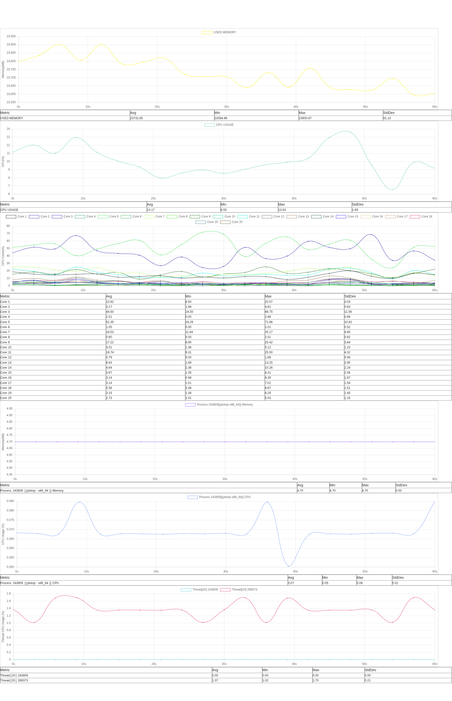

## Plotop 系统性能采集与展示工具


### 项目概述

开发Plotop的主要目的是解决在嵌入式系统上做性能统计的困难。以往，我们通过top在嵌入式系统上观察性能数据，但是top信息往往是一小段时间内的快照，无法判断长时间运行的性能数据。针对这个问题，我开发过一些top解析脚本，通过将top信息写入文件，然后再解析问题，但是这种方案不尽我意。

Plotop由一个轻量的client和一个server组成。client负责采集性能数据并发送到server，client仅做简单的数据采集，避免对被测系统的影响。server可以一拖多用，支持多台client同时采集数据。server提供了一个web界面，可以实时查看性能数据，可以做数据分析，统计一段时间的性能数据。



当前已实现以下核心组件：

- **C++17 客户端**：实现基础网络数据采集
- **Python Flask 服务端**：实现数据接收和存储
- **Web界面**：实时数据图表展示

### 主要功能

✅ 基础HTTP数据采集
✅ 简单数据缓存处理
✅ 静态图表展示
✅ 支持按照pid或进程名过滤数据
🚧 可视化配置界面（开发中）

### 快速开始

#### 环境要求

- Python 3.8+
- C++17 兼容编译器
- CMake 3.12+

#### 安装步骤

```bash
# 克隆仓库
git clone https://github.com/caibingcheng/plotop.git
cd plotop

# 安装Python依赖
pip install -r requirements.txt

# 编译客户端
make
```

或者

通过pip安装服务端：

```bash
pip install git+https://github.com/caibingcheng/plotop.git
```

从[https://github.com/caibingcheng/plotop/releases/latest](https://github.com/caibingcheng/plotop/releases/latest)下载最新的客户端。

#### 启动服务

```bash
# 启动服务端
python -m server
# plotop

# 运行客户端
./plotop -i <server_ip> -p <server_port> -d <interval_seconds>
```

### 项目结构

```bash
plotop/
├── client/            # C++客户端代码
│   ├── linux/         # 平台特定实现
│   ├── network.cc     # 网络通信模块
│   └── packet.h       # 数据包协议定义
├── server/            # Python服务端
│   ├── app.py         # Flask主程序
│   └── templates/     # 网页模板
├── makefile           # 构建配置
├── requirements.txt   # Python依赖
└── setup.py           # 打包配置
```

### 贡献指南

1. Fork 本仓库
2. 创建特性分支 (`git checkout -b feature/your-feature`)
3. 提交修改 (`git commit -am 'Add some feature'`)
4. 推送分支 (`git push origin feature/your-feature`)
5. 创建Pull Request

### 许可证

[MIT License](LICENSE)
