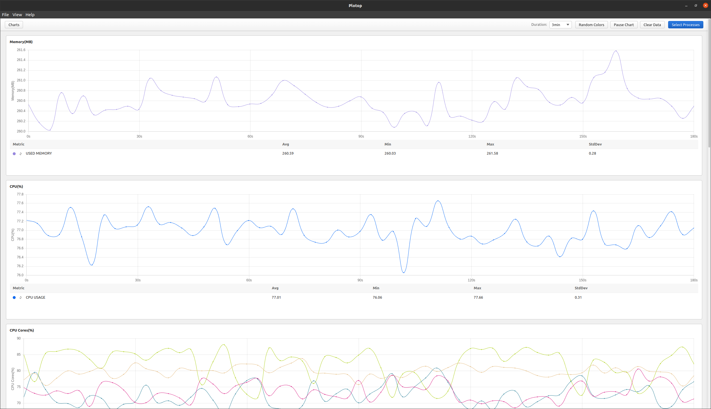

## Plotop 系统性能采集与展示工具


### 项目概述

开发Plotop的主要目的是解决在嵌入式系统上做性能统计的困难。以往，我们通过top在嵌入式系统上观察性能数据，但是top信息往往是一小段时间内的快照，无法判断长时间运行的性能数据。针对这个问题，我开发过一些top解析脚本，通过将top信息写入文件，然后再解析问题，但是这种方案不尽我意。

Plotop由一个**轻量**的client和一个server组成。client负责采集性能数据并发送到server，client仅做简单的数据采集，避免对被测系统的影响。server可以一拖多用，支持多台client同时采集数据。server提供了一个web界面，可以实时查看性能数据，可以做数据分析，统计一段时间的性能数据。



当前已实现以下核心组件：

- **C++17 客户端**：实现基础网络数据采集（TCP），仅做采集，确保client对host的影响小
- **TypeScript/Electron 服务端**：实现数据接收、存储与桌面 UI
- **Web界面**：实时数据图表展示

### 主要功能

- 基础TCP数据采集
- 简单数据缓存处理
- 静态图表展示
- 支持按照pid或进程名过滤数据（Web端）
- 可视化配置界面
- `--web` 模式：仅启动后端服务，通过浏览器访问
- 默认模式：启动 Electron 桌面应用

### 快速开始

#### 环境要求

- Node.js 18+
- C++17 兼容编译器

#### 安装步骤

```bash
# 克隆仓库
git clone https://github.com/caibingcheng/plotop.git
cd plotop

# 安装 Node 依赖
npm install

# 编译客户端
make

# 启动交叉编译
CROSSCOMPILER=aarch64-linux-gnu- make
```

#### 启动服务

```bash
# 启动桌面应用
npm start

# 启动 Web 模式（仅后端，通过浏览器访问）
npm run web

# 开发模式（ts-node 启动桌面应用）
npm run dev

# 打包
npm run dist

# 运行客户端
./plotop -i <server_ip> -p <server_port> -d <interval_seconds>

# 查看帮助
./plotop --help

# 在 Web 界面按进程名或 PID 过滤数据
# 打开 http://<server_ip>:5000/plot?ip=<client_ip>，点击 "Select Processes"
```

### 项目结构

```bash
plotop/
├── client/            # C++客户端代码
│   ├── linux/         # 平台特定实现
│   ├── network.cc     # 网络通信模块
│   └── packet.h       # 数据包协议定义
├── src/               # TypeScript/Electron 服务端
│   ├── main.ts        # Electron 主进程 / CLI 入口
│   ├── server/        # Express + Socket.IO + TCP server
│   └── renderer/      # 前端静态资源
├── docs/              # 文档与规划
├── makefile           # 构建配置
├── package.json       # Node 依赖与脚本
└── tsconfig.json      # TypeScript 配置
```

### 贡献指南

1. Fork 本仓库
2. 创建特性分支 (`git checkout -b feature/your-feature`)
3. 提交修改 (`git commit -am 'Add some feature'`)
4. 推送分支 (`git push origin feature/your-feature`)
5. 创建Pull Request

### 许可证

[MIT License](LICENSE)
