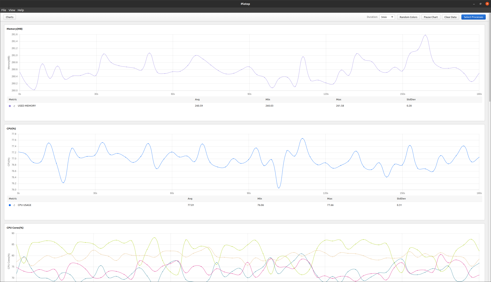

## Plotop 系统性能采集与展示工具


### 项目概述

Plotop 用于解决在嵌入式系统上做长时间性能统计的困难。`top` 只能看到一瞬间的快照，难以判断长时间运行后的性能趋势。

Plotop 把**采集**和**分析**分成两个独立工具：

- **轻量采集端**：一个 C++ 小进程，运行在被测设备上，只负责采集性能数据并发送出去，对被测系统影响极小。
- **离线分析端**：一个 Electron 桌面应用，运行在你的电脑上，接收并保存采集端的数据，实时展示图表，也支持事后分析历史趋势。

采集端和分析端分离后，一台电脑可以同时监控多台设备；分析端不依赖网络和浏览器，离线即可使用。



### 主要功能

- 长时间采集 CPU、内存、进程级性能数据
- 实时查看多设备性能曲线
- 按 PID 或进程名过滤关注的数据
- 离线 Electron 桌面应用，无需浏览器
- 导出 PNG / 离线 HTML 报告

### 快速开始

#### 环境要求

- Node.js 18+
- C++17 兼容编译器

#### 安装

**方式一：从 Release 下载离线 App（推荐）**

访问 [GitHub Releases](https://github.com/caibingcheng/plotop/releases)，下载对应平台的安装包即可直接使用。

**方式二：从源码构建**

```bash
git clone https://github.com/caibingcheng/plotop.git
cd plotop
npm install
make
```

#### 使用

1. 启动分析端（桌面应用）

```bash
npm start
```

2. 在 Plotop 窗口的"暂无客户端"页面中：
   - 选择本机 IP 和目标设备架构（x86_64 / arm64）
   - 复制命令到目标设备执行，或前往 **GitHub Releases** 下载预编译 client

3. 或者手动在目标设备上启动采集端：

```bash
# 下载并运行（替换 arch 为目标架构）
wget https://github.com/caibingcheng/plotop/releases/download/v0.2.3/plotop-v0.2.3-x86_64.zip \
  -O plotop.zip && unzip plotop.zip && chmod +x plotop
./plotop -i <分析端IP> -p 28081 -d 1

# 或从源码编译后运行
git clone https://github.com/caibingcheng/plotop.git && cd plotop && make
./plotop -i <分析端IP> -p 28081 -d 1
```

4. 在 Plotop 窗口中选择对应设备 IP，即可查看实时性能曲线。

### Client 与 Server 版本匹配

Plotop 在 client 与 server 之间引入了 **协议版本号** (`protocol_version`) 来标识通信兼容性：

- 当前协议版本为 `1`。
- Client 连接时会自动上报版本信息和协议版本。
- Server 在 IP 列表中显示每个 client 的版本和兼容性状态。
- 如果版本不兼容或有更新可用，IP 列表对应行会显示提示和下载链接。
- **不影响使用**：即使版本不匹配，数据采集和展示也不会被阻断，仅给出升级建议。
- 默认显示"从源码编译"和"下载二进制"两种部署方式。

#### 其他启动方式

```bash
# Web 模式：只启动后端，通过浏览器访问
npm run web

# 开发模式
npm run dev

# 打包为离线安装包
npm run dist

# 查看采集端帮助
./plotop --help
```

### 贡献指南

1. Fork 本仓库
2. 创建特性分支 (`git checkout -b feature/your-feature`)
3. 提交修改 (`git commit -am 'Add some feature'`)
4. 推送分支 (`git push origin feature/your-feature`)
5. 创建 Pull Request

### 许可证

[MIT License](LICENSE)
